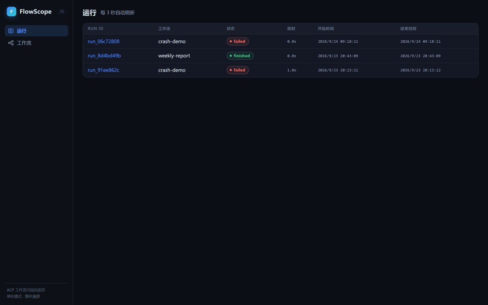
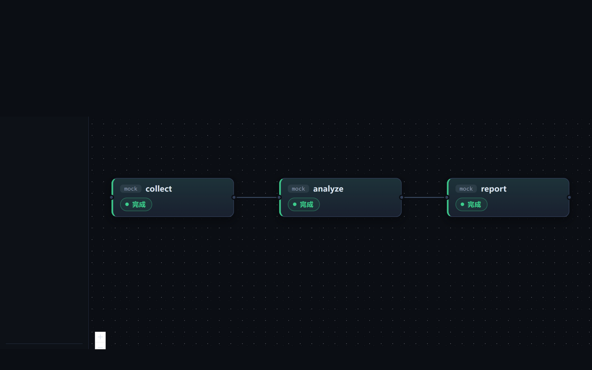
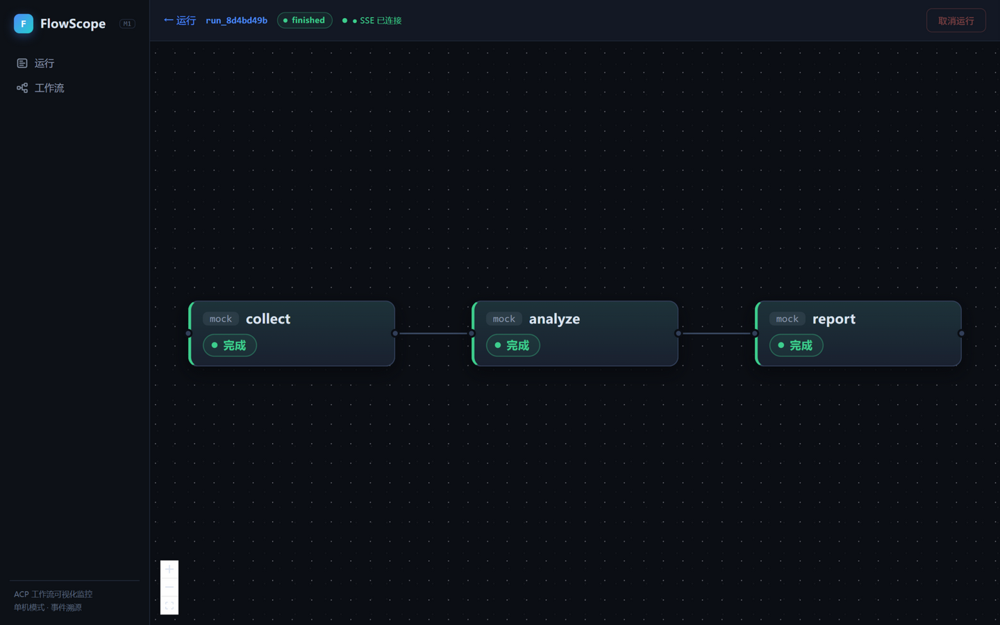
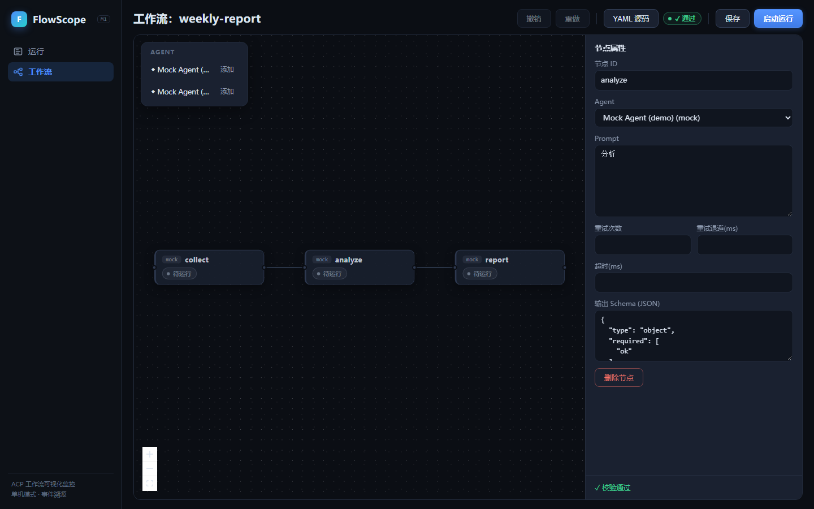

# FlowScope

ACP（Agent Client Protocol）agent 工作流的可视化监控台：把"黑盒"的 agent 会话变成
看得见的工作流——每个节点在做什么、进展到哪一步、为什么失败，一目了然。

## 界面预览

| 运行列表 | DAG 运行监控 | 节点抽屉（五 tab） | 工作流画布编辑器 |
|:---:|:---:|:---:|:---:|
|  |  |  |  |

---

# 一、使用指南

## 1.1 三步上手

### 第 1 步：启动 FlowScope

M1 阶段有两种启动方式（安装双击包是 M2 计划）：

| 方式 | 命令 | 适合 |
|---|---|---|
| **桌面应用**（推荐） | `cargo run -p flowscope-desktop`，或直接双击 `target\debug\flowscope-desktop.exe` | 日常使用，独立窗口 |
| **浏览器方式** | 见下方「开发者指南 · 快速开始」中启动 dev 服务器的命令，然后访问 <http://127.0.0.1:39271> | 不想开窗口、或远程查看 |

桌面应用首次启动会自动在 `~/.flowscope/`（你的用户主目录下）创建数据目录，并注册
两个示例 agent（`mock` 演示用、`bad-mock` 故意崩溃用），方便你零配置先体验。

### 第 2 步：注册你的企业 agent（一次性配置）

你的 agent 需要以 ACP v1 协议（JSON-RPC over stdio）运行。编辑
`~/.flowscope/agents.toml`，为你的 agent 增加一个条目：

```toml
[agents.my-agent]                                    # key：工作流里引用的名字
name = "我的企业 Agent"                               # 显示名（可选）
command = ["node", "D:/agents/enterprise-agent.js", "--acp"]   # 启动命令
cwd = "D:/agents/enterprise"                          # 工作目录（可选，也作为文件读取白名单根）
env = { API_KEY_FILE = "secrets/api.key" }            # 环境变量（可选，凭据不落库）
```

保存后**重启 FlowScope** 生效。之后它就会出现在画布左侧的 agent 面板里，添加节点时
直接选用（对应 YAML 里的 `agent: my-agent`）。

> 权限说明（M1 策略）：agent 读取 `cwd` 范围内的文件自动放行，写文件与终端操作自动
> 拒绝——每次自动决策都会出现在节点日志里，全程可审计。

#### 接入 ZCode 本地实测（免配置）

桌面安装的 ZCode CLI 无原生 ACP 模式，FlowScope 通过社区桥
[`zcode-acp-server`](https://www.npmjs.com/package/zcode-acp-server)（ACP ↔ ZCode
Protocol 翻译）接入：**桥与 node≥22 就位时，首次启动会自动在 agents.toml 生成
`zcode` 条目**（含 `ZCODE_NODE`/`ZCODE_BIN`/`ZCODE_ACP_RUNTIME` 环境变量与默认模型
`builtin:bigmodel-coding-plan\GLM-5.3-Flash`，避开无头必败的 start-plan；模型可在
条目的 `model` 字段改）。重启后在 agent 面板即可拖出 ZCode 节点直接跑——节点会话
视图里能看到真实的流式回答、思考过程与工具调用。

路径与本机默认不同时，用环境变量覆盖后再启动：`ZCODE_NODE`（≥22 的 node）、
`ZCODE_BIN`（zcode.cjs 入口）、`ZCODE_ACP_BRIDGE`（桥的 cli.js）、`ZCODE_ACP_CWD`
（会话工作目录，默认用户主目录）。

### 第 3 步：创建你的第一个工作流

进入「工作流」→「**新建工作流**」，全程在画布上点选/拖拽完成，不用写一行 YAML：

1. **加节点**：左侧 agent 面板点「添加」（或直接把 agent 拖进画布）——每个节点就是
   一次独立的 agent 会话；
2. **连线**：从上游节点**右侧**圆点按下，拖到下游节点**左侧**圆点松手，即定义执行
   顺序；点连线还能配条件（如 `output.ok == true` 才继续）；
3. **填 Prompt**：点任意节点，右侧属性面板填写 Prompt（节点 ID、Agent、重试、超时、
   输出 Schema 都在这块面板改）；
4. **改名称**：点画布空白处打开「工作流设置」，填名称与版本；需要参数就点「添加
   参数」填键值对（启动运行时可覆盖）；
5. **保存并试跑**：点工具栏「保存」（校验不通过会被拦下，具体问题列在面板底部）→
   点「**启动运行**」直接发起第一次运行，自动跳转监控页。

画布上的每一步都可撤销/重做（`Ctrl+Z` / `Ctrl+Shift+Z`）。**建议先打开内置的
`weekly-report` 示例**（使用 mock agent，无需配置）看看画布长什么样、跑通全流程，
再照着搭你自己的真实 agent 工作流。

<details>
<summary>偏好 YAML？工具栏「YAML 源码」可直接粘贴（含注释说明）</summary>

点工具栏「YAML 源码」打开源码层，粘贴下面模板后点「**应用到画布**」，即可转成图形
继续编辑（解析错误会就地列在下方；注意：图形编辑后导出会重排格式、注释不保留）：

```yaml
meta: {name: my-flow, version: 1}     # 名字与版本

params:                               # 启动时可覆盖的参数
  topic: "本周销售数据"

nodes:                                # 每个节点 = 一次独立的 agent 会话
  - id: collect                       # 节点唯一 id
    agent: my-agent                   # 引用 agents.toml 里的 key
    prompt: "收集 {{ params.topic }}，输出 JSON：{\"ok\": bool, \"path\": str}"

  - id: analyze
    agent: my-agent
    prompt: "分析以下数据：{{ nodes.collect.output }}"   # 引用上游节点的输出
    output_schema:                    # 可选：约束上游输出/本节点产出为结构化 JSON
      type: object
      required: [ok]
      properties: {ok: {type: boolean}}
    retry: {max: 2, backoff_ms: 3000} # 可选：失败自动重试
    timeout_ms: 600000                # 可选：超时（毫秒）

  - id: report
    agent: my-agent
    prompt: "基于分析结果写周报：{{ nodes.analyze.output }}"

edges:                                # 执行顺序与条件
  - {from: collect, to: analyze}
  - {from: analyze, to: report, when: "output.ok == true"}  # 条件不满足则 report 被跳过
```

</details>

## 1.2 日常使用

### 编辑既有工作流

「工作流」→ 点开任意工作流卡片，直接进入**画布编辑器**：拖动节点摆布局、从左侧
agent 面板继续添加节点、拖拽圆点改连线；点节点 / 点连线 / 点空白处，右侧面板分别在
「节点属性」「条件边」「工作流设置」三态间切换。工具栏常用项：

- **撤销 / 重做**（`Ctrl+Z` / `Ctrl+Shift+Z`）：画布操作步步可回退；
- **YAML 源码**：滑出源码层，可查看当前画布的 YAML，粘贴/修改后点「应用到画布」
  同步回图形——校验错误会就地列在下方（注意：注释不保留）；
- **校验徽章**：`✓ 通过` 或 `⚠ N`（悬停可看具体问题）；
- **保存**：校验不通过会被拦下，按提示修好画布再存。

### 启动一次运行

「工作流」→ 点开工作流卡片进入编辑器 → 点工具栏「**启动运行**」→ 自动跳转监控页。
启动直接使用画布设置里的当前参数（点画布空白处可查看/修改，如参数名 `topic`、参数值
`本月数据`；留空即 `{}` 用默认值）。

### 读懂监控页

**节点六种状态**：

| 状态 | 颜色 | 含义 |
|---|---|---|
| 待运行 | 灰 | 排队中，等上游完成 |
| 运行中 | 蓝 + 脉冲光圈 | agent 正在执行；节点上同时显示已运行时长和当前工具名 |
| 完成 | 绿 | 本节点成功 |
| 失败 | 红 | 失败（悬停/抽屉可见原因） |
| 已取消 | 橙 | 被手动取消 |
| 跳过 | 灰虚线 | 条件边未满足，本节点（及其下游）未执行 |

**顶栏**：运行 ID、总状态徽章、`● SSE 已连接`（实时通道指示，断线会显示橙色横幅
并自动重连，重连期间内容暂停更新）、「取消运行」按钮。

**点击任意节点**打开右侧抽屉，五个标签页回答五个问题：

| Tab | 回答的问题 |
|---|---|
| 消息 | agent 到现在"说"了什么？（思考过程以折叠块显示） |
| 工具 | agent 调用了哪些工具？各自什么状态？ |
| Plan | agent 自己列的子任务清单，完成到第几条？ |
| 日志 | agent 进程的原始输出（stderr），排查崩溃用 |
| 输入输出 | 节点产出的结构化结果（输入回显为 M2 计划） |

### 失败了怎么排查

1. 运行列表里找红色 `failed` 记录，点进去；
2. 点红色节点 → 「日志」tab 看 agent 进程的原始输出（崩溃时会带 stderr 尾部）；
3. 「消息」tab 看 agent 失败前说了什么；
4. 若配置了 `retry`，会先自动重试（节点上可见重试次数），重试耗尽才标记失败。

### 运行历史

「运行」页每 3 秒自动刷新，按时间倒序列出所有运行：状态、**耗时**、起止时间。
点 Run ID 可随时回看任何一次历史运行的完整监控页（事件全部存档，回看与实时同构）。

### 从文件夹读取工作流（git 团队流）

团队把工作流 YAML 放进 **git 仓库管理**时，用侧边栏「**文件夹**」页直接读取磁盘目录：
输入目录路径（如 `D:\team-repo\workflows`）点「**读取**」，目录下所有 `.yaml`/`.yml`
工作流按**标记分组**、组内名称字母序列出（名称 / 版本 / 文件 / 解析状态 / 标记），
点「**在编辑器打开**」即可载入画布编辑器（解析失败的文件也能打开修改）。目录输入会被
记住，下次打开自动读取；「**刷新**」按钮随时重读当前目录（保存到文件夹后可刷出最新）。

- **分类标记**：在 YAML 的 `meta` 下写 `tags: [演示, alpha]`（或在编辑器「工作流设置 →
  标签」里填，逗号分隔），文件夹页按**首个 tag** 分组（无 tag 进「未分类」组、恒排最后），
  组行可点击展开/收起（状态按目录记住），行上显示全部标记徽标。
- **保存到文件夹**：从文件夹页「在编辑器打开」的工作流，编辑器工具栏「保存」旁会多一个
  「**保存到文件夹**」按钮——把当前画布内容（含 tags）**写回来源文件夹的同名文件**，
  与「保存」（存进 FlowScope 数据库）并存，想让团队共享就写回后提交 git。
- **默认目录**：不填路径时读 `~/.flowscope/workflows`；可用环境变量
  `FLOWSCOPE_WORKFLOW_DIR` 改默认（如指向团队的 git 工作流仓库检出位置）。
- **首次启动**：若该目录不存在，FlowScope 会创建它并放入示例
  `~/.flowscope/workflows/hello-zcode.yaml`（一个 zcode 建文件的演示工作流）。
- **注意**：除显式点「保存到文件夹」外，FlowScope 不会往这个文件夹写任何东西（读取、
  刷新均只读）；点「保存」是存进 FlowScope 自己的数据库，两边的改动互不影响。

## 1.3 你的数据在哪

桌面版与浏览器版共用同一个数据目录 `~/.flowscope/`：

| 文件/目录 | 内容 |
|---|---|
| `flowscope.db` | 全部工作流、运行记录与事件（SQLite 单文件，可直接备份迁移） |
| `agents.toml` | 你的 agent 注册表 |
| `scripts/` | 示例 agent 的行为脚本 |
| `workflows/` | 文件夹工作流默认目录（首启含 `hello-zcode.yaml` 示例，见 1.2） |

dev 服务器（浏览器方式）默认用仓库内 `target/dev-home/`，互不干扰。

## 1.4 常见问题

| 现象 | 原因与处理 |
|---|---|
| 页面打不开 | 服务没在运行。桌面版重开应用；浏览器方式按开发者指南命令重新启动 |
| 顶部橙色"连接断开"横幅 | SSE 断线，会自动重连补齐缺口，无需操作；持续不恢复则刷新页面 |
| 节点一直"待运行" | 上游节点未完成或条件边不满足（检查边上的 `when`） |
| 画布上连不上线 | 认准方向：从上游节点**右侧**圆点按下，拖到下游节点**左侧**圆点松手 |
| YAML 粘贴后画布没变化 | 粘贴只是写进文本框，需点下方「**应用到画布**」；解析失败时错误会列在源码层下方，按提示修正 |
| agent 起不来 | 检查 `agents.toml` 的 `command` 路径与 `cwd` 是否正确，在终端手动跑一遍该命令 |
| 服务重启后运行显示 `interrupted` | 上次退出时未结束的运行被标记中断（M1 不支持续跑，可重新发起） |
| 想换端口（浏览器方式） | 启动命令加 `--port <端口号>` |

---

# 二、开发者指南

## 架构

```
┌─────────────────────────────┐        ┌──────────────────────────────┐
│  前端 (React + ReactFlow)    │        │  企业 agent (任意 ACP v1 实现) │
│  运行列表 / DAG 监控 / 抽屉   │        │  例: Claude Code、自研 agent   │
└──────────────┬──────────────┘        └──────────────▲───────────────┘
               │ HTTP REST + SSE（同源）                │ JSON-RPC over stdio
               │                                        │ (spawn 子进程)
┌──────────────▼──────────────────────────────────────┴───────────────┐
│                    flowscope-core（内嵌 axum 服务）                   │
│  ┌──────────┐  ┌───────────┐  ┌──────────┐  ┌─────────────────────┐  │
│  │ REST API │  │ SSE 事件流 │  │ 工作流引擎 │  │ ACP 层（会话/注册表） │  │
│  └────┬─────┘  └─────┬─────┘  └────┬─────┘  └─────────┬───────────┘  │
│       └──────┬───────┴──────┬──────┴──────────────────┘              │
│         ┌────▼──────────────▼─────┐                                 │
│         │ SQLite 事件溯源 + 产物     │   ← 每条会话更新/状态迁移都落库    │
│         └─────────────────────────┘                                 │
└──────────────────────────────────────────────────────────────────────┘
               ▲
               │ 进程内组装（共用 bootstrap）
┌──────────────┴──────────────┐
│ 宿主：dev 启动器（独立进程）   │
│ 或 Tauri 桌面壳（apps/desktop）│
└─────────────────────────────┘
```

- **flowscope-core**：工作流 DSL 解析与调度引擎、ACP 子进程会话层、axum REST+SSE
  API、SQLite 事件溯源存储。dev 启动器（`bin/dev.rs`）与 Tauri 桌面壳共用
  `bootstrap()` 组装入口。
- **flowscope-mock-agent**：脚本驱动的 ACP v1 wire 级 mock（另支持崩溃注入），
  用于开发、演示与测试。
- **frontend**：React SPA（运行列表、工作流画布编辑器——ReactFlow 可编辑画布 +
  属性面板 + YAML 源码层、运行监控 ReactFlow 实时 DAG + 节点抽屉五 tab），由后端
  静态托管，同源直连。
- **apps/desktop**：Tauri 2 壳，进程内嵌引擎，窗口直连本地回环。

## 快速开始（开发环境）

前置：Rust（stable）、Node.js 20+ 与 npm。

```bash
# 1) 构建 mock agent（演示/冒烟测试需要）
cargo build -p flowscope-mock-agent

# 2) 构建前端
cd frontend
npm install
npm run build
cd ..

# 3) 启动开发服务器（首次启动会自动种子两个示例工作流：
#    weekly-report：3 节点全链路演示；crash-demo：进程崩溃失败注入）
cargo run -p flowscope-core --bin dev -- --port 39271 --home target/dev-home \
  --frontend-dist frontend/dist --mock-agent-bin target/debug/flowscope-mock-agent.exe
```

打开 <http://127.0.0.1:39271>。桌面版开发：`cargo run -p flowscope-desktop`。

## 测试矩阵

| 层 | 命令 | 覆盖 |
|---|---|---|
| Rust 单元/集成 | `cargo test` | DSL 解析/校验、引擎调度与重试、ACP 会话层（含子进程 wire 级）、事件/存储/SSE、脱敏纯函数 `events::redact()`、mock-agent 脚本机 |
| 前端单元 | `cd frontend && npm test` | 事件 reducer、图解析/布局、NodeCard/NodeDrawer 组件 |
| E2E 冒烟 | `cd frontend && npm run e2e` | Playwright 拉起 dev bin：mock 工作流全链路与崩溃注入 |

E2E 首次运行需先 `npx playwright install chromium`。

## 设计文档

- **系统现状（权威，整体修改从这里出发）**：`docs/superpowers/specs/2026-10-02-flowscope-current-state.md`
- 文档索引与交付日志：`docs/superpowers/README.md`、`docs/superpowers/CHANGELOG.md`
- 历史设计（M1 spec）：`docs/superpowers/specs/2026-09-22-flowscope-design.md`
- 各里程碑计划与归档待办：`docs/superpowers/plans/`

---

# 三、当前版本边界

## M1 + M2a（当前）交付

core / mock-agent / 桌面壳三件套、ACP v1 会话层、工作流 DSL 与调度引擎（条件边、
重试、参数渲染）、SQLite 事件溯源 + SSE、四个核心视图（运行列表 / 工作流列表 /
详情编辑 / 运行监控）；M2a 新增**画布图形编辑器**——拖拽添加节点、连线把手建边/
条件边表单、右侧面板编辑节点属性与工作流设置，撤销重做 + YAML 源码层双向同步，
无需手写 YAML 即可搭建工作流。

## M2 计划（节选，剩余）

独立服务器 + Web 部署（远程承载引擎）、运行回放与瀑布时间线、渲染后 prompt 回显、
agent 健康探活、桌面安装包。完整清单见现状文档 §8（docs/superpowers/specs/2026-10-02-flowscope-current-state.md）。

## 已知限制（当前）

- **渲染后 prompt 不回显**：抽屉「输入输出」tab 的输入侧为占位（M2）。
- **agent 无健康探测**：agent 配置错误要等运行时才暴露。
- **桌面版未出安装包**：需以命令/可执行文件方式启动。
- **单用户本地工具**：无鉴权 / 多租户。
- **取消语义局限**：仅支持本进程内取消；重启后遗留运行标记 `interrupted`。
